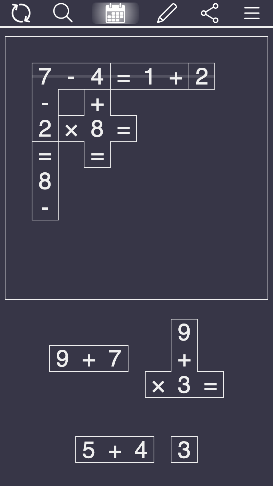

# Arithmejig

🚧 This game is in early stages of playtesting. Expect some bugs and upcoming changes! 👷‍♀️

A math-based jigsaw puzzle.

**Players:** 1

**Time:** 5 minutes

[Play Now!](https://skedwards88.github.io/arithmejig)

Do you have feedback or ideas for improvement? [Open an issue](https://github.com/skedwards88/arithmejig/issues/new).

Want the word version of this game? Check out [Crossjig](https://crossjig.com). Want more games? Visit [SECT Games](https://skedwards88.github.io/).

## Development

To build, run `npm run build`.

To run locally with live reloading and no service worker, run `npm run dev`. (If a service worker was previously registered, you can unregister it in chrome developer tools: `Application` > `Service workers` > `Unregister`.)

To run locally and register the service worker, run `npm start`.

To deploy, push to `main` or manually trigger the GitHub Actions `deploy.yml` workflow.
